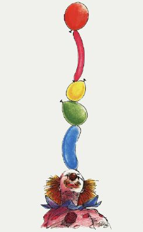

# Balloon Crazy

**Balloon Crazy** is a whimsical and challenging game where players ride a skateboard to catch falling balloons on top of their head. Originally designed for Atari computers, this engaging game is now available for multiple platforms including Apple II, Commodore 64, IBM PC/PCjr, and TI-99/4A.

## Game Mechanics

### Objective
The main objective is to catch falling balloons by positioning the player character underneath them. You must balance on a skateboard and collect a specific number of balloons to score points and advance to the next level.

### Gameplay
1. **Movement**: 
   - Use the joystick or keyboard (depending on the version) to move your player left and right across the screen.
   - In some versions, you can use paddle controllers instead of a joystick.

2. **Catching Balloons**: 
   - Balloons fall from the top of the screen in different colors and speeds:
     - **Blue balloons** fall slowly and are worth the fewest points.
     - **Green balloons** fall faster and are worth more points.
     - **Red balloons** fall the fastest and are worth the most points.
   - Position the player directly under a falling balloon to catch it on top of their head.

3. **Scoring**:
   - Points are scored based on the type of balloon caught:
     - For example, in some versions:
       - Blue balloon = 10 points
       - Green balloon = 20 points
       - Red balloon = 30 points.
   - Points are added to your score only when a required number of balloons are caught and you pop them by pressing the fire button or a specific key.

4. **Bouncing Balloons**:
   - If you miss a balloon, you have a chance to bounce it back into the air by holding down the fire button (or space bar) and running into the balloon, allowing you to attempt catching it again.
   - This mechanic is available in some, but not all, versions of the game.

5. **Levels**:
   - Clearing all balloons from a screen lets you advance to the next level, where gameplay becomes more challenging with faster and more frequent falling balloons.
   - You gain extra players or "lives" when you reach certain score thresholds or complete levels, depending on the version.

6. **Game Over**:
   - The game ends if you lose all three players by missing balloons and falling off the skateboard.

### Platform-Specific Controls

#### Atari
- **Joystick**: Moves player left and right.
- **Fire button**: Bounces missed balloons.
- Paddle controllers can be used with specific modifications to the code.

#### Commodore 64
- **Joystick (Port 2)**: Moves player left and right.
- **Fire button**: Bounces missed balloons.

#### Apple II
- **Paddle**: Moves player left and right.
- **Paddle button**: Bounces missed balloons.
- **Keyboard (IIc/IIe)**: `Open-Apple` key to move left, `Closed-Apple` key to move right, `Space bar` to bounce.

#### IBM PC/PCjr
- **Joystick (adjustable)**: Moves player left and right.
- **Paddle button**: Used for adjusting or applying settings.

#### TI-99/4A
- **Keyboard**: 'S' key to move left and 'D' key to move right.
- **Joystick (optional)**: Used for movement.

## Installation
Refer to the specific instructions provided in the source files or companion documentation for each platform to assemble and run Balloon Crazy on your system.

## Source
The original source code and detailed game description are from the December 1985 issue of COMPUTE! magazine. Here's the citation:

- Joseph Russ, "Balloon Crazy," COMPUTE! Magazine, Issue 67, December 1985. Available online at [AtariMagazines.com](https://www.atarimagazines.com/compute/issue67/305_1_BALLOON_CRAZY.php).

Enjoy the delightful and challenging world of Balloon Crazy! Catch those balloons, score high, and become the ultimate Balloon Crazy champion!